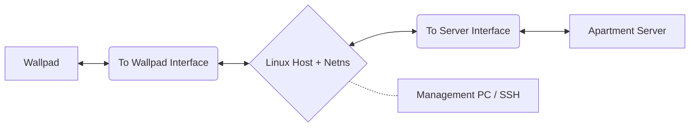

# 월패드 패킷 분석을 위한 네트워크 미러링 환경 구축 가이드

본 문서는 `netns`(Network Namespace)와 `veth`(Virtual Ethernet)를 활용하여 홈 네트워크 월패드와 아파트 서버 간의 통신을 캡처하고 분석할 수 있는 **투명 브릿지(Transparent Bridge)** 환경 구축 방법을 설명합니다.

이러한 환경을 구축하는 궁극적인 이유는 **아파트 서버나 세대 월패드 기기로부터 탐지(Detection)되지 않으면서**, 중간에서 안전하게 패킷을 분석하거나 새로운 패킷을 생성(Generation)하여 주입하기 위함입니다.

---

## 1. 개요 및 필요성

일반적인 네트워크 브릿지와 달리, 중간자(MITM) 구성을 통해 통신을 제어해야 하는 이유는 다음과 같습니다.

*   **보안 및 정책 준수 (MAC/IP Spoofing)**: 아파트 서버는 등록된 월패드의 MAC 주소와 IP만을 허용합니다. 분석 장비의 정보가 노출되면 즉시 차단되므로, 양방향 위장이 필수적입니다.
*   **패킷 제어 및 분석**: 단순 스위칭만으로는 패킷이 리눅스 커널 스택을 우회합니다. `iptables` 및 `netns`를 통해 트래픽을 가로채야 실시간 분석 및 변조가 가능합니다.
*   **라우팅 충돌 방지**: 동일한 IP 대역이 양쪽 인터페이스에 실릴 경우 발생하는 커널 수준의 경로 충돌(Routing Conflict)을 네임스페이스 격리로 해결합니다.

---

## 2. 하드웨어 구성

정상적인 패킷 미러링을 위해 최소 3개의 독립된 네트워크 인터페이스가 권장됩니다.



*   **Management**: 제어 및 모니터링을 위한 SSH 접속용 포트 (Wi-Fi 또는 내장 이더넷).
*   **To Server**: 아파트 벽면 단자(서버 방향)와 연결할 인터페이스.
*   **To Wallpad**: 월패드 기기 본체와 연결할 인터페이스.

> [!TIP]
> *   **하드웨어 권장**: 라즈베리 파이(Raspberry Pi)와 같이 Linux(데비안 계열 등) 환경이 지원되는 소형 SBC(Single Board Computer)로도 충분히 구성 가능하며, 전력 소모와 공간 면에서 매우 효율적입니다.
> *   **인터페이스 확장**: 포트가 부족한 경우 **USB to Ethernet** 어댑터를 사용하여 인터페이스를 확장할 수 있습니다.

---

## 3. 사전 정보 수집 (Information Collection)

중간자(MITM) 환경을 구성하기 위해 가장 먼저 확보해야 할 **4가지 핵심 데이터**입니다. 이 단계에서 수집한 정보가 틀리면 이후의 모든 네트워크 설정이 작동하지 않습니다.

| 항목 | 설명 | 스크립트 변수명 |
| :--- | :--- | :--- |
| **월패드 IP** | 우리집 월패드에 할당된 실제 IP 주소 | `CLIENT_IP` |
| **월패드 MAC** | 우리집 월패드의 고유 물리 주소 (예: 00:11:...) | `CLIENT_MAC` |
| **서버 IP** | 월패드가 통신하는 아파트 게이트웨이/서버 IP | `SERVER_IP` |
| **서버 MAC** | 해당 서버의 고유 물리 주소 | `SERVER_MAC` |

---

### 3.1 월패드 정보 수집 (Client Info)

우리집 월패드의 주소를 찾는 단계입니다.

*   **방법 1: 설정 메뉴 확인 (가장 추천)**
    *   월패드 본체의 `설정` > `네트워크` 메뉴에 진입하여 **IP 주소**와 **MAC 주소**를 메모합니다.
*   **방법 2: 기기 스티커 확인**
    *   월패드 본체를 벽에서 살짝 떼어내면 뒷면 라벨에 **MAC 주소**가 적혀 있는 경우가 많습니다.
*   **방법 3: 직접 연결 스니핑 (Sniffing)**
    *   월패드와 리눅스 PC를 1:1로 직접 연결한 뒤, 터미널에서 다음 명령어를 실행하고 월패드를 조작합니다.
    ```bash
    sudo tcpdump -i eth_wallpad -en
    # 결과 중 '00:aa:bb... > ff:ff:ff...' 처럼 나오는 소스 MAC과 IP를 확인합니다.
    ```

### 3.2 아파트 서버 정보 수집 (Server Info)

월패드가 대화하는 아파트 단지 측의 정보를 찾는 단계입니다.

*   **방법 1: 게이트웨이 정보 활용**
    *   3.1단계의 월패드 메뉴에서 확인한 **'기본 게이트웨이(Gateway)'** IP가 보통 **SERVER_IP**가 됩니다.
*   **방법 2: 서버 MAC 주소 찾기 (중요)**
    *   서버의 IP는 알지만 MAC을 모를 때 사용합니다. 리눅스 PC의 한쪽 포트에 월패드 IP를 임시로 설정하고 서버 방향에 연결한 뒤 다음 명령을 내립니다.
    ```bash
    ping -c 1 [서버_IP]
    ip neigh show  # 서버 IP 옆에 나타나는 MAC 주소가 SERVER_MAC입니다.
    ```
*   **방법 3: 공유기로 확인**
    *   집에서 쓰는 공유기를 벽면 단자에 연결하고 관리 페이지의 **'인터넷 연결 정보'**를 보세요. 거기 적힌 **'기본 게이트웨이'**의 IP와 MAC 주소가 바로 우리가 찾는 서버 정보입니다.

---

### 3.3 최종 데이터 확인표

모든 정보가 준비되었다면 아래 표를 채워보세요.

*   [ ] **CLIENT_IP**: (예: 172.16.10.15)
*   [ ] **CLIENT_MAC**: (예: AA:BB:CC:DD:EE:FF)
*   [ ] **SERVER_IP**: (예: 172.16.10.1 - 보통 게이트웨이)
*   [ ] **SERVER_MAC**: (예: 00:11:22:33:44:55)

---

## 4. 네트워크 구성 프로세스

독립된 네트워크 스택을 구성하기 위해 다음 과정을 거칩니다. (1-2단계는 수동 준비, 3-6단계는 스크립트 자동 수행)

### [수동 준비 단계] - 실행 전 필수
*   **1. 인터페이스 식별**: `ip link` 명령어로 물리 포트(`LAN_SERVER`, `LAN_WALLPAD`)의 정확한 이름을 확인하여 스크립트 변수에 입력합니다.
*   **2. 핵심 정보 수집**: 앞선 가이드를 통해 확보한 4가지 필수 정보(월패드 및 서버의 IP/MAC)를 스크립트 변수에 정확히 기입합니다.

### [스크립트 자동화 단계] - `wallpad-init.sh` 실행 시 처리
*   **3. 네임스페이스 생성**: `wp_zone`이라는 격리된 네트워크 공간을 만들어 호스트 시스템과 분리합니다.
*   **4. 인터페이스 할당 및 위장**: 각 물리 포트에 위조된 MAC/IP를 설정하여 월패드와 서버가 서로 직접 통신한다고 믿게 만듭니다.
*   **5. 가상 터널(veth) 구축**: 호스트와 네임스페이스를 잇는 `vlan0`, `vwan0` 인터페이스를 생성하고 데이터 통로(`10.0.0.x`)를 활성화합니다.
*   **6. Dummy 생성 및 NAT 설정**: 가상 타겟(Dummy)을 생성하고 `iptables` 규칙을 적용하여 모든 실시간 트래픽을 호스트의 분석 인터페이스로 강제 리다이렉션합니다.

---

## 5. 통합 자동화 스크립트: `wallpad-init.sh`

아래 스크립트는 위의 복잡한 설정을 자동으로 수행합니다. **실행 전 환경에 맞게 변수를 반드시 수정하십시오.**

```bash
#!/bin/bash

# ==========================================================
# 1. 환경 변수 설정 (사용자 환경에 맞게 수정 필요)
# ==========================================================

# 서버 방향(외부) 물리 인터페이스
LAN_SERVER='eth_srv'

# 월패드 방향(내부) 물리 인터페이스
LAN_WALLPAD='eth_wallpad'

# 네트워크 격리를 위한 네임스페이스 이름
NAMESPACE='wp_zone'

# 실제 아파트 망 정보
SERVER_IP='172.x.x.x/16'       # 게이트웨이 또는 서버 IP
SERVER_MAC='AA:BB:CC:DD:EE:FF' # 게이트웨이 MAC
CLIENT_IP='172.x.x.y/16'       # 실제 월패드 할당 IP
CLIENT_MAC='11:22:33:44:55:66' # 실제 월패드 MAC

# 가상 통신용 내부 브릿지 설정 (10.0.0.x 대역 사용)
# ----------------------------------------------------------
# * 선택 이유: 실제 아파트 망(172.x.x.x)과 겹치지 않는 별도의 사설 IP 대역이 필요합니다.
# * 수정 가능 여부: 수정 가능합니다. 단, 현재 사용 중인 다른 네트워크와 겹치지 않아야 하며
#   스크립트 내의 모든 V_WAN, V_LAN, DUMMY IP들이 동일 대역 내에 있어야 합니다.
# ----------------------------------------------------------
V_WAN_NAME='vwan0'             # 네임스페이스 내부 가상 IF
V_WAN_IP='10.0.0.254/24'
V_LAN_NAME='vlan0'             # 호스트 가상 IF
V_LAN_IP='10.0.0.1/24'

# NAT 트래픽 유도를 위한 Dummy 디바이스 (가상 타겟)
# ----------------------------------------------------------
# * 더미 인터페이스가 필요한 이유 (Why Dummy?):
#   1. 트래픽 리다이렉션: 실제 서버 IP(172.x.x.x)로 가는 패킷을 커널이 가로채려면, 
#      그 패킷이 로컬(호스트/네임스페이스) 어딘가에 '도착'해야 합니다. 
#   2. 가상 종착점 제공: 더미 IP는 패킷이 통과하는 가상의 '경유지' 역할을 하여, 
#      iptables DNAT를 통해 모든 트래픽을 가상 터널(veth) 쪽으로 강제로 흐르게 만듭니다.
#   3. 라우팅 루프 방지: 물리 인터페이스와 중복되는 IP를 직접 사용하지 않음으로써,
#      패킷이 어디로 가야 할지 몰라 제자리에서 도는 현상을 방지합니다.
# ----------------------------------------------------------
# * 선정 가이드 (How to Choose):
#   1. 가상 터널 대역(V_WAN/V_LAN) 내의 비어있는 IP를 선택하세요.
#   2. 실제 아파트 망의 IP(SERVER_IP, CLIENT_IP)와 겹치지 않아야 합니다.
#   3. 이 IP들은 패킷을 가로채기 위한 '이정표' 역할을 하며, 외부로 노출되지 않습니다.
#   4. 여기서는 예시로 .100, .200을 사용했으나, 범위 내의 다른 번호도 가능합니다.
# ----------------------------------------------------------
DUMMY_SRV_NAME='dm-server'
DUMMY_SRV_IP='10.0.0.100'      # 월패드가 가리킬 가상 서버 IP (임의 지정)
DUMMY_CLT_NAME='dm-client'
DUMMY_CLT_IP='10.0.0.200'      # 서버가 가리킬 가상 월패드 IP (임의 지정)

# ==========================================================
# 3. 초기화 및 네임스페이스 생성
# ==========================================================

# 스크립트는 반드시 루트 권한으로 실행되어야 네트워크 스택을 제어할 수 있습니다.
if [ "$EUID" -ne 0 ]; then
  echo "Error: Root privileges are required. Please run with sudo."
  exit 1
fi

# 커널 패킷 포워딩 활성화: 인터페이스 간에 패킷이 넘어다닐 수 있도록 허용합니다. (중요)
/sbin/sysctl -w net.ipv4.ip_forward=1

# 기존 물리 인터페이스 초기화: 잔여 설정이나 IP 주소 충돌을 방지하기 위해 다운시킨 후 주소를 지웁니다.
/sbin/ip link set dev $LAN_SERVER down
/sbin/ip link set dev $LAN_WALLPAD down
/sbin/ip address flush dev $LAN_SERVER
/sbin/ip address flush dev $LAN_WALLPAD

# 네트워크 네임스페이스(WP_ZONE) 생성: 호스트와 격리된 별도의 네트워크 공간을 만듭니다.
# 'ip netns exec' 명령어를 통해 이 격리된 공간 안에서만 동작하는 명령을 내릴 수 있습니다.
/sbin/ip netns del $NAMESPACE 2>/dev/null
/sbin/ip netns add $NAMESPACE
# 네임스페이스 내부에서도 패킷 포워딩이 가능하도록 설정합니다.
/sbin/ip netns exec $NAMESPACE /sbin/sysctl -w net.ipv4.ip_forward=1

# ==========================================================
# 4. 인터페이스 할당 및 위장 (Spoofing)
# ==========================================================

# [호스트 측] 서버 방향 물리 인터페이스에 월패드의 실제 IP/MAC을 입힙니다.
# 아파트 서버는 이 장치를 '진짜 월패드'라고 믿게 됩니다.
/sbin/ip address add $CLIENT_IP dev $LAN_SERVER
/sbin/ip link set dev $LAN_SERVER address $CLIENT_MAC
/sbin/ip link set dev $LAN_SERVER up

# [네임스페이스 측] 월패드 방향 물리 인터페이스를 격리된 공간(WP_ZONE)으로 이동시킵니다.
/sbin/ip link set dev $LAN_WALLPAD netns $NAMESPACE
# 네임스페이스 내부로 들어간 인터페이스에 '아파트 서버'의 IP/MAC을 부여합니다.
# 이제 월패드 기기는 이 장치를 '아파트 서버'라고 믿게 됩니다.
/sbin/ip netns exec $NAMESPACE /sbin/ip address add $SERVER_IP dev $LAN_WALLPAD
/sbin/ip netns exec $NAMESPACE /sbin/ip link set dev $LAN_WALLPAD address $SERVER_MAC
/sbin/ip netns exec $NAMESPACE /sbin/ip link set dev $LAN_WALLPAD up
/sbin/ip netns exec $NAMESPACE /sbin/ip link set dev lo up

# ==========================================================
# 5. 가상 터널(veth) 생성 및 라우팅
# ==========================================================

# veth(Virtual Ethernet)는 두 공간을 잇는 가상의 랜선입니다. 
# vlan0은 호스트에, vwan0은 네임스페이스 내부에 위치하여 두 공간이 소통하는 전용 통로가 됩니다.
/sbin/ip link add $V_LAN_NAME type veth peer name $V_WAN_NAME
/sbin/ip link set dev $V_WAN_NAME netns $NAMESPACE

# 가상 랜선 양 끝에 내부 통신용 사설 IP(10.0.0.x)를 부여합니다.
/sbin/ip address add $V_LAN_IP dev $V_LAN_NAME
/sbin/ip netns exec $NAMESPACE /sbin/ip address add $V_WAN_IP dev $V_WAN_NAME

/sbin/ip link set dev $V_LAN_NAME up
/sbin/ip netns exec $NAMESPACE /sbin/ip link set dev $V_WAN_NAME up

# 네임스페이스 내부에서 나가는 모든 트래픽의 게이트웨이를 호스트 쪽 터널 IP(10.0.0.1)로 지정합니다.
/sbin/ip netns exec $NAMESPACE /sbin/ip route add default via ${V_LAN_IP%/*} dev $V_WAN_NAME

# ==========================================================
# 6. NAT 및 트래픽 리다이렉션 (핵심 로직)
# ==========================================================

# Dummy 인터페이스는 패킷을 낚아채기 위한 '가상 낚시터'입니다.
# 실제 타겟 IP로 가는 패킷을 이 더미 IP로 가로채어 분석 장비가 확인할 수 있게 만듭니다.
/sbin/ip netns exec $NAMESPACE /sbin/ip link add $DUMMY_CLT_NAME type dummy
/sbin/ip netns exec $NAMESPACE /sbin/ip address add $DUMMY_CLT_IP/32 dev $DUMMY_CLT_NAME
/sbin/ip netns exec $NAMESPACE /sbin/ip link set dev $DUMMY_CLT_NAME up

/sbin/ip link add $DUMMY_SRV_NAME type dummy
/sbin/ip address add $DUMMY_SRV_IP/32 dev $DUMMY_SRV_NAME
/sbin/ip link set dev $DUMMY_SRV_NAME up

# DNAT(Destination NAT): 목적지 주소를 강제로 바꿉니다.
# 1. 월패드에서 온 패킷을 호스트의 더미(이정표)로 낚아챕니다.
# 2. 서버에서 온 패킷을 네임스페이스의 더미(이정표)로 낚아챕니다.
/sbin/iptables -t nat -I PREROUTING -d ${CLIENT_IP%/*} -j DNAT --to-destination $DUMMY_CLT_IP
/sbin/iptables -t nat -I PREROUTING -d $DUMMY_SRV_IP -j DNAT --to-destination ${SERVER_IP%/*}

/sbin/ip netns exec $NAMESPACE /sbin/iptables -t nat -I PREROUTING -d ${SERVER_IP%/*} -j DNAT --to-destination $DUMMY_SRV_IP
/sbin/ip netns exec $NAMESPACE /sbin/iptables -t nat -I PREROUTING -d $DUMMY_CLT_IP -j DNAT --to-destination ${CLIENT_IP%/*}

# MASQUERADE(SNAT): 응답 패킷이 다시 우리 장비를 거쳐 돌아올 수 있도록 출발지 주소를 변환합니다.
/sbin/iptables -t nat -A POSTROUTING -j MASQUERADE
/sbin/ip netns exec $NAMESPACE /sbin/iptables -t nat -A POSTROUTING -j MASQUERADE

echo "Configuration completed: Wallpad network isolation and redirection are active."
```

---

## 6. 구성 확인 및 검증 (Verification)

설정이 완료된 후 다음 명령어를 통해 정상 작동 여부를 확인하십시오.

### 1. `ping` 테스트
네임스페이스 내부에서 통신이 가능한지 확인합니다.
```bash
# 네임스페이스 내부에서 서버로 핑 전송
sudo ip netns exec wp_zone ping -c 3 [외부_서버_IP]
```

### 2. 패킷 캡처 (가장 중요)
통행하는 모든 패킷은 호스트 리눅스의 `vlan0` 가상 인터페이스를 관통해야 합니다.
```bash
# 실시간 패킷 흐름 감지
sudo tcpdump -i vlan0 -n
```
> `tcpdump`에서 패킷이 잡힌다면 모든 설정이 성공한 것입니다.

---

## 7. 설정 원복 및 초기화 (Cleanup)

설정된 가상 네트워크를 모두 삭제하고 원래 상태로 되돌리려면 다음 명령어를 차례로 실행하십시오. (또는 재부팅만으로도 대부분 초기화됩니다)

```bash
#!/bin/bash
NAMESPACE='wp_zone'
LAN_SERVER='[본인_인터페이스_이름]'
LAN_WALLPAD='[본인_인터페이스_이름]'

# 1. 네임스페이스 삭제 (관련 veth/dummy도 함께 삭제됨)
sudo ip netns del $NAMESPACE

# 2. 물리 인터페이스 초기화
sudo ip link set $LAN_SERVER down
sudo ip link set $LAN_SERVER address [원래_MAC]
sudo ip addr flush dev $LAN_SERVER
sudo ip link set $LAN_SERVER up

sudo ip link set $LAN_WALLPAD up
```

---

## 8. 주의사항 및 가이드

### 필수 패키지 (Prerequisites)
이 가이드를 따라하기 위해 다음 도구들이 설치되어 있어야 합니다.
- `iproute2`: 네트워크 인터페이스 및 네임스페이스 제어용.
- `iptables`: NAT 및 트래픽 리다이렉션용.
- `tcpdump`: 패킷 분석 및 검증용.

### 설정 유지 및 휘발성 (Persistence)
- **일회성 설정**: 본 문서의 모든 네트워크 설정은 메모리 상에서 이루어지며, **재부팅 시 모두 초기화**됩니다.
- **영구 적용**: 분석 환경이 안정화된 후 영구 적용을 원하신다면 **`systemd` 서비스(추천)**를 생성하여 부팅 시 본 스크립트가 실행되도록 등록하십시오. `/etc/network/interfaces`의 `post-up` 설정을 사용할 수도 있으나, `netns`와 `iptables`를 함께 제어하기에는 `systemd`가 더 안정적입니다.

### 기타 주의사항

*   **IP/MAC 위장 안전 수칙**:
    - **동시 접속 금지 (중요)**: 원래의 월패드와 리눅스 장비(위장 장치)가 동시에 아파트 서버 망에 연결되면 **IP/MAC 충돌(Conflict)**이 발생하여 네트워크 마비나 보안 알림이 뜰 수 있습니다. 위장 장비를 연결하기 전 반드시 월패드에서 랜선을 먼저 뽑으십시오.
    - **일시적 사용**: 정보 수집을 위한 위장은 필요한 정보를 얻은 즉시 해제하는 것이 안전합니다. 본격적인 분석은 본 문서의 '투명 브릿지' 환경을 완성한 뒤 진행하십시오.
*   **인터페이스 명칭 확인**: `ip link` 명령어로 출력되는 이름을 정확히 입력하세요. USB 타입의 경우 연결 시마다 이름이 바뀔 수 있습니다.
*   **관리 인터페이스 보호**: 현재 SSH 연결에 사용 중인 인터페이스를 `LAN_SERVER` 또는 `LAN_WALLPAD`로 지정할 경우 즉시 연결이 단절되므로 주의하십시오.
*   **IP 대역 충돌 및 수정**: 가상 터널용 `10.0.0.x` 대역은 실제 아파트 망(보통 `172.x.x.x`)과 겹치지 않게 설정된 것이지만, 필요에 따라 `192.168.200.x` 등으로 자유롭게 수정할 수 있습니다. 단, 스크립트 내 모든 가상 IP 변수(`V_LAN`, `V_WAN`, `DUMMY`)들도 같은 대역으로 맞춰주어야 합니다.

이제 모든 패킷은 호스트 리눅스의 `vlan0` 가상 인터페이스를 통과하게 됩니다. `tcpdump`나 `Wireshark`를 통해 자유롭게 분석을 시작하세요!

---

## 9. 초보자를 위한 3단계 핵심 요약 (TL;DR)

내용이 너무 복잡하다면, 다음 **딱 3단계**만 기억하고 실행하세요.

### 1단계: 4가지 정보 찾기
*   가장 먼저 **내 월패드 IP/MAC**과 **아파트 서버 IP/MAC** 총 4개 정보를 메모하세요. 
*   이 정보 없이는 아무것도 진행할 수 없습니다. (방법 A, B, C 중 하나를 쓰세요.)

### 2단계: 기기 연결하기
*   **월패드 기기 본체** --- (랜선) --- **내 리눅스 PC (월패드용 포트)**
*   **벽면 인터넷 단자** --- (랜선) --- **내 리눅스 PC (서버용 포트)**
*   *주의: 월패드를 단자에 직접 꽂지 말고, 반드시 내 PC를 중간에 끼워 넣어야 합니다.*

### 3단계: 스크립트 실행
*   본문의 `wallpad-init.sh` 내용을 복사해 파일을 만들고, 메모해둔 4가지 정보를 변수에 넣으세요.
*   터미널에서 `sudo bash wallpad-init.sh`를 실행하세요.
*   그다음 `sudo tcpdump -i vlan0` 명령어를 입력했을 때 글자가 올라오면 성공입니다!
